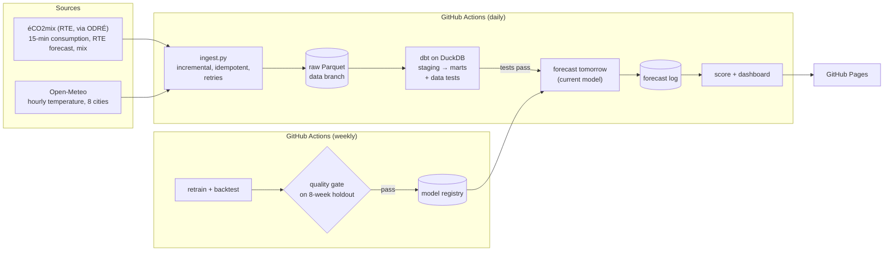

# France Grid Forecast

[](https://github.com/Oradixx/france-grid-forecast/actions/workflows/ci.yml)
[](https://github.com/Oradixx/france-grid-forecast/actions/workflows/pipeline.yml)


**Live dashboard: https://oradixx.github.io/france-grid-forecast/**

Every morning, an automated pipeline downloads the latest French electricity data, tests it, forecasts
**tomorrow's national consumption hour by hour**, and scores every past forecast against what was really
consumed, next to **RTE's official day-ahead forecast** and a naive baseline.

It runs entirely on free tools: GitHub Actions for scheduling, Parquet files on a git branch as the
data lake, dbt on DuckDB for transformations and data tests, scikit-learn for the model, GitHub Pages for
the dashboard. No cloud account, no server.

## Architecture



| Step | What it does | Where |
|---|---|---|
| **Extract** | Downloads the éCO2mix history once (2012 onwards, ~25 MB), then only the last days of real-time data on each run; stores them as downloaded, partitioned by year or month. Re-running a day replaces a partition, never appends to it. | [`ingest.py`](src/gridforecast/ingest.py) |
| **Transform** | dbt models on DuckDB read the Parquet files directly: type and deduplicate the two éCO2mix datasets, aggregate to hourly, weight city temperatures into a national one. | [`dbt/models`](dbt/models) |
| **Test** | 19 dbt data tests: uniqueness, ranges, no missing hour, data freshness, and a cross-check between RTE's forecast and the measured consumption. A failure stops the run before any forecast is published. | [`schema.yml`](dbt/models/schema.yml), [`dbt/tests`](dbt/tests) |
| **Forecast** | Gradient boosting (scikit-learn) on calendar, French holidays and bridge days, temperature (hour, day mean, slow average for building inertia) and consumption lags. | [`features.py`](src/gridforecast/features.py), [`model.py`](src/gridforecast/model.py) |
| **MLOps** | Weekly retrain on the full history, promotion only through a quality gate, registry of every version, append-only forecast log, scikit-learn version check at load time. | [`model.py`](src/gridforecast/model.py), [`forecast.py`](src/gridforecast/forecast.py) |
| **Publish** | Static dashboard (Chart.js) with the forecasts, the live track record, the backtest, the registry and the data test results. | [`site/`](site/index.html), [`site.py`](src/gridforecast/site.py) |

## Results

Mean absolute percentage error (MAPE) on hourly national consumption, first run (September 2026):

| Evaluation | Our model | RTE day-ahead | Naive (same hour last week) |
|---|---|---|---|
| Holdout: last 8 weeks, model trained on everything before | **1.87 %** | 1.45 % | 3.50 % |
| Backtest: trained on 2012-2024, real-time data of summer 2026 | 2.26 % | 1.43 % | 4.38 % |
| Backtest: trained on 2012-2024, all of 2025-2026 | 2.23 % | not comparable (see below) | 6.50 % |

The model halves the error of the naive baseline; RTE's official forecast stays better, which is expected
from the grid operator's own forecasting team and weather inputs. Both evaluations use observed temperatures,
so they are optimistic: the [live track record](https://oradixx.github.io/france-grid-forecast/), built from
forecasts really published each morning with weather forecasts, is the number that counts.

## Design choices

- **No leakage by construction.** The forecast is issued on the morning of day D for the 24 hours of D+1,
  like RTE's. At that time the last complete day is D-1, so the shortest lag is 48 hours ("same hour the
  day before yesterday"), never 24. Training, backtest and prediction share one feature function, so the
  model never sees features built differently in production.
- **Published forecasts are immutable.** The log keeps what was published each morning; a later re-run the
  same day cannot quietly improve the track record (it is tested).
- **Honest evaluation.** The backtest uses *observed* temperatures, so it is an optimistic bound. The live
  track record, which uses real weather forecasts, is the number that counts. Both are compared with RTE's
  day-ahead forecast and with a naive "same hour last week" baseline.
- **Relative target.** The model predicts consumption divided by its level over the last 7 available days,
  then multiplies back. It follows slow trends (efficiency, the 2022-23 energy savings) and it makes the
  model insensitive to the level gap between the two versions of RTE's data (next section). Older years
  also weigh less in training (half-life of 2 years).
- **Retrain only through a gate.** Every week a candidate is trained without the last 8 weeks, scored on
  them, and promoted only if its error is below 6 % and at least 25 % below the naive baseline. Every
  candidate is kept in the registry with its scores, promoted or not. A change to the model code triggers
  a retrain on the next run (the model version carries a hash of its definition).
- **The lake is a git branch.** The `data` branch holds a single snapshot commit (raw Parquet, forecast log,
  models, reports), rewritten by each run: free, versioned by the forecast log itself, and it keeps the
  `main` history for code only.

## What the data taught me

Real sources are messier than tutorials:

- **Daylight saving time.** RTE publishes one row per *local* clock time. In spring, the non-existent
  times 02:00-02:45 still get rows, stamped with the same UTC time as 03:00-03:45 (same consumption,
  different forecast value): they are dropped by checking that the local time matches the UTC timestamp.
  In autumn, the repeated hour is published only once, so one UTC hour per year has no data: it is
  interpolated, and a dbt test makes sure interpolation never happens on any other day.
- **Schema drift.** The history and real-time datasets do not share a schema: newer columns
  (offshore wind, batteries), and columns such as `ech_comm_allemagne_belgique` that are text in one and
  integers in the other. Staging reads files by column name and casts every measure explicitly.
- **Granularity changes.** Consumption is published every 30 minutes in the history and every 15 minutes
  in real time; the hourly mean and a `n_points` column keep both comparable.
- **Two versions of the truth.** RTE publishes consumption in real time, then replaces it months later
  with consolidated and definitive values, which sit **2 to 3 % higher**. RTE's own day-ahead forecast is
  biased by -2.1 % against the consolidated history but only +0.3 % against real-time data: it targets the
  real-time version. Scoring it against consolidated data made it look worse than my first model; the
  comparison is now only made on real-time data, and the live scores freeze the measured value the day it
  is first published.
- **Revisions.** Recent real-time values are revised and months move from "real time" to "consolidated"
  to "definitive": staging keeps the most final version of each timestamp.

## Run it locally

```bash
git clone https://github.com/Oradixx/france-grid-forecast && cd france-grid-forecast
python -m venv .venv && source .venv/bin/activate
pip install -e ".[dev]"

pytest                       # tests on a frozen sample of real data (tests/fixtures), no network

gridforecast ingest          # first run: whole history, ~10 minutes (weather API pacing)
(cd dbt && dbt build --profiles-dir .)
gridforecast backtest && gridforecast train
gridforecast predict && gridforecast evaluate
gridforecast site --out public && python -m http.server -d public
```

The lake goes to `./lake` and the warehouse to `./warehouse.duckdb` (override with `GRID_LAKE` and
`GRID_WAREHOUSE`).

## Structure

```
├── src/gridforecast/   # ingest, features, model, forecast, site, CLI
├── dbt/                # staging and mart models, seed (cities and weights), data tests
├── site/               # dashboard page
├── tests/              # pytest + fixture lake built from real éCO2mix data
└── .github/            # CI, daily pipeline, weekly retrain, lake checkout/save actions
```

## Data and licences

- **éCO2mix** national data by RTE, published on [ODRÉ](https://odre.opendatasoft.com/) under the
  Licence Ouverte 2.0: [real time](https://www.data.gouv.fr/datasets/donnees-eco2mix-nationales-temps-reel-1),
  [consolidated and definitive](https://www.data.gouv.fr/datasets/donnees-eco2mix-nationales-consolidees-et-definitives).
- **Weather** from [Open-Meteo](https://open-meteo.com/) (free API for non-commercial use, data under
  CC BY 4.0).
- Code under the MIT licence. A personal project, not affiliated with RTE.
